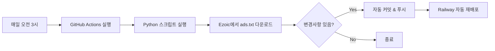

# Ads.txt 자동 업데이트

이 프로젝트는 GitHub Actions를 사용하여 Ezoic의 ads.txt를 매일 자동으로 업데이트합니다.

## 🚀 설정 방법

### 1. Ezoic 사이트 등록
1. [Ezoic 대시보드](https://www.ezoic.com/dashboard)에 로그인
2. 사이트 추가 (`keero.site` 또는 `convert4u.keero.site`)
3. 사이트 승인 대기

### 2. 자동화 설정 (완료됨 ✅)
GitHub Actions가 이미 설정되어 있습니다:
- **실행 시간**: 매일 한국시간 오전 3시
- **동작**: Ezoic에서 최신 ads.txt 다운로드
- **커밋**: 변경사항이 있을 때만 자동 커밋 & 푸시

### 3. 수동 실행 (선택사항)
필요시 GitHub에서 수동으로 실행할 수 있습니다:
1. GitHub 저장소 → Actions 탭
2. "Update Ads.txt Daily" 클릭
3. "Run workflow" 버튼 클릭

## 📝 로컬에서 수동 업데이트

```bash
# Python 스크립트 실행
python update_ads_txt.py

# 결과 확인
cat public/ads.txt

# Git 커밋
git add public/ads.txt
git commit -m "update: ads.txt"
git push
```

## 🔍 작동 확인

사이트에서 확인:
```
https://convert4u.keero.site/ads.txt
```

## ⚙️ 설정 파일

- **워크플로우**: `.github/workflows/update-ads-txt.yml`
- **스크립트**: `update_ads_txt.py`
- **출력 파일**: `public/ads.txt`

## 📅 업데이트 주기 변경

`.github/workflows/update-ads-txt.yml` 파일의 cron 설정 수정:

```yaml
schedule:
  # 매일 실행
  - cron: '0 18 * * *'  # 한국시간 오전 3시
  
  # 매주 월요일 실행
  # - cron: '0 18 * * 1'
  
  # 매주 실행 (월, 수, 금)
  # - cron: '0 18 * * 1,3,5'
```

## 🛠️ 문제 해결

### ads.txt가 업데이트되지 않음
1. Ezoic에 사이트가 등록되어 있는지 확인
2. GitHub Actions 로그 확인
3. 수동으로 스크립트 실행해서 에러 확인

### 404 오류
- Ezoic에 사이트가 아직 등록되지 않았거나 승인 대기 중입니다.
- 사이트 승인 후 자동으로 작동합니다.

## 📊 동작 방식



## ✅ 완료!

이제 ads.txt는 자동으로 최신 상태를 유지합니다. 
더 이상 수동으로 업데이트할 필요가 없습니다! 🎉
